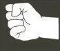
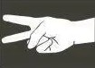

# rock-papers-scissors

-------------------------------------------------------HTML-----------------------------------------------------------
<!DOCTYPE html>
<html lang="en">
<head>
    <meta charset="UTF-8">
    <meta http-equiv="X-UA-Compatible" content="IE=edge">
    <meta name="viewport" content="width=device-width, initial-scale=1.0">
    <title>Rock Papers Scissors</title>
</head>
<title>Rock Papers Scissors</title>
<link rel="stylesheet" href="style.css">

<body> 

 Let us Settle This Like Adults!!! 

   <h1 class = "gameText" id = "you">You: </h1>
   <h1 class = "gameText" id = "computer">Computer: </h1>
   <h1 class = "gameText" id = "result">Result: </h1>

   

    <button class = "choice">ROCK</button>
    <button class = "choice">PAPERS</button>
    <button class = "choice">SCISSORS</button>
   

   

</body>
</html>

-------------------------------------------------------css-----------------------------------------------------------

body {
    background-color: rgb(110, 124, 141);
    width: 100%;
    height:100vh;
    background-image: url("BK2.JPG");
    background-repeat: repeat;
    background-size: cover;
    background-position: center 
} 

.choice{
  background: burlywood;
  border: none;
  outline: none;
  cursor: pointer;
  font-size: 2rem;
  transition: 100ms;
  /* justify-content: space-evenly; */
 

  
 
}
.choice:hover {
  transform: scale(1.2);
}

#choices {
  display: flex;
  /* width: 100%; */
  justify-content: space-evenly;
  
}

#gameOn{
   font-family:Cambria, Cochin, Georgia, Times, 'Times New Roman', serif;
   font-size: xx-large solid;
   border: 3px salmon;
   border-radius: 25px;
   padding: 10px;
   background-color: bisque;
   text-align: center;
}

h1 {
  font-family:Cambria, Cochin, Georgia, Times, 'Times New Roman', serif;
  font-size: larger;
  border: 3px salmon;
  border-radius: 25px;
  padding: 10px;
  background-color: bisque;
  text-align: center;

}

           -------------------------------------------------------Script-----------------------------------------------------------
           
           
           
           
           const playerText = document.querySelector("#you");
const computerText = document.querySelector("#computer");
const resultText = document.querySelector("#result");
const choiceBtns = document.querySelectorAll(".choice");
let player;
let computer;
let result;

choiceBtns.forEach(button => button.addEventListener("click", () => {

    player = button.textContent;
    computerTurn();
    playerText.textContent = `Player: ${player}`;
    computerText.textContent = `Computer: ${computer}`;
    resultText.textContent = checkWinner();
}));

function computerTurn(){

      const randNum = Math.ceil(Math.random() *3);
// /* or you can do 
//    const randNum = Math.floor(Math.random() * 3) + 1; 

    switch(randNum){
      case 1:
        computer = "ROCK";
        break;
      case 2:
        computer = "PAPERS";
        break;
      case 3:
        computer = "SCISSORS";
        break;
    }
}
function checkWinner(){
    if(player === computer){
      return "Draw!";
    }
    else if(computer == "ROCK"){
      return (player == "PAPERS") ? "You Win!" : "You Lose!"
    }
    else if(computer == "PAPERS"){
      return (player == "SCISSORS") ? "You Win!" : "You Lose!"
    }
    else if(computer == "SCISSORS"){
      return (player == "ROCK") ? "You Win!" : "You Lose!"
    }
}

